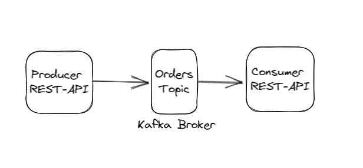

## spring-boot-3-apache-kafka-producer-consumer

Purpose :  
1- Send message to Kafka broker topic from kafka-producer-rest-api via kafka-template  
2- Read message from Kafka broker topic to kafka-consumer-rest-api  
3- Decrease coupling between microservices.

  

### Tech Stack
Java 17  
Kafka Broker ( must be installed and started at localhost:9092 before starting producer and consumer apis )  
H2 Database Engine  
spring boot  
spring boot starter data jpa  
spring boot starter web  
spring boot starter test  
spring kafka  
hibernate  
logback  
maven  
maven-surefire-plugin  
springfox-core  
springfox-spring-web   
springdoc openAPI starter webMVC UI  
datasource-proxy  
Docker  
 

### Install Kafka on Windows 10

1-) Download the latest Kafka release and extract it into "D:\DEV\kafka_2.13-3.3.1" directory :

https://downloads.apache.org/kafka/3.3.1/kafka_2.13-3.3.1.tgz

<pre>
D:\DEV>cd kafka_2.13-3.3.1
D:\DEV\kafka_2.13-3.3.1>cd bin
D:\DEV\kafka_2.13-3.3.1\bin>cd windows
D:\DEV\kafka_2.13-3.3.1\bin\windows>
</pre>

2-) Open command line window and start zookeeper

<pre>
D:\DEV\kafka_2.13-3.3.1\bin\windows>.\zookeeper-server-start.bat ..\..\config\zookeeper.properties
</pre>

3-) Open another command line window and start Kafka server

<pre>
D:\DEV\kafka_2.13-3.3.1\bin\windows>.\kafka-server-start.bat ..\..\config\server.properties
[2022-12-26 11:42:24,857] INFO Kafka version: 3.3.1 (org.apache.kafka.common.utils.AppInfoParser)
[2022-12-26 11:42:24,867] INFO Kafka commitId: e23c59d00e687ff5 (org.apache.kafka.common.utils.AppInfoParser)
[2022-12-26 11:42:24,868] INFO Kafka startTimeMs: 1672044144839 (org.apache.kafka.common.utils.AppInfoParser)
[2022-12-26 11:42:24,891] INFO [KafkaServer id=0] started (kafka.server.KafkaServer)
</pre>

4-) Open another command line window and create "orders" topic

<pre>
D:\DEV\kafka_2.13-3.3.1\bin\windows>.\kafka-topics.bat --create --topic orders --bootstrap-server localhost:9092
Created topic orders.

D:\DEV\kafka_2.13-3.3.1\bin\windows>.\kafka-topics.bat --describe --topic orders --bootstrap-server localhost:9092
Topic: orders   TopicId: 5dz_M-ssT2ClPkdDtmWZcg PartitionCount: 1       ReplicationFactor: 1    Configs:
        Topic: orders   Partition: 0    Leader: 0       Replicas: 0     Isr: 0
</pre>

5-) Write some events to the "orders" topic by running the console producer client

<pre>
D:\DEV\kafka_2.13-3.3.1\bin\windows>.\kafka-console-producer.bat --topic orders --bootstrap-server localhost:9092
>apple
>orange
</pre>

6-) Open another command line window and run the console consumer client to read the events from the "orders" topic

<pre>
D:\DEV\kafka_2.13-3.3.1\bin\windows>.\kafka-console-consumer.bat --topic orders --from-beginning --bootstrap-server localhost:9092
apple
orange
</pre>

Note : In case of LEADER_NOT_AVAILABLE error add hostname and port into "\config\server.properties" file.
<pre>
listeners=PLAINTEXT://localhost:9092
</pre>
[2022-12-28 23:32:23,019] WARN [Producer clientId=console-producer] Error while fetching metadata with correlation id 23 : {orders=LEADER_NOT_AVAILABLE}  
(org.apache.kafka.clients.NetworkClient)  
